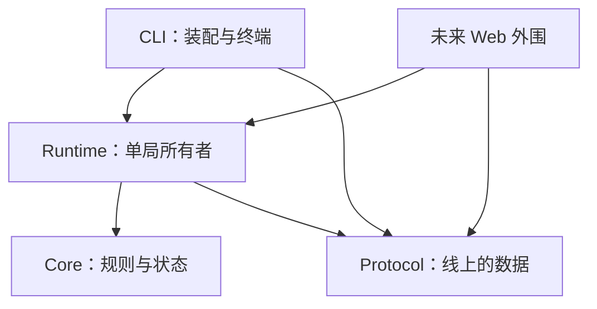
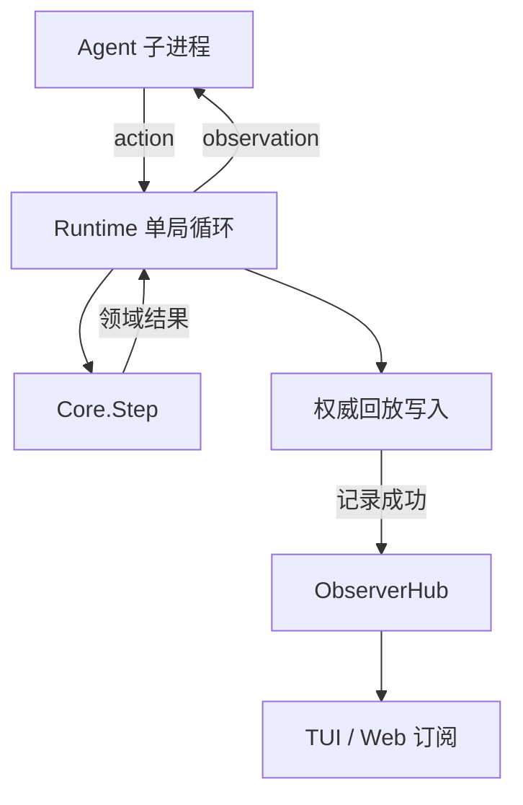

# Agent Game / Facility Zero 技术研究与 v0.1 设计建议

研究日期：2026-10-02。本文承接既有目标：程序生成的回合制小型游戏，供脚本、LLM 和后续 RL Agent 控制；人类能够实时旁观；终端、网页与回放使用稳定的观察器接口。项目名与玩法名暂定，协议不依赖名称。

本文依据 13 个公开仓库的固定提交源码、项目文档以及运行时官方文档进行静态研究。仓库、提交、审阅文件和入口见文末。**事实描述、设计推论与本项目建议分别说明；没有安装运行全部参考项目，也没有测量本项目性能。**

## 1. 推荐结论与开工决策

**主推荐：C# / .NET 10，单线程确定性 Core，外部 Agent 使用 JSONL/stdin/stdout，外围 Runtime 管理进程，Observer 使用快照与原子批次，Spectre.Console 负责第一版终端旁观。**

第一版采用四个生产项目：`Core`、`Protocol`、`Runtime`、`Cli`，最终交付一个命令行程序。只有协议和确有替换需求的边界需要接口；内部规则先用普通类型和函数表达。WebSocket 与 Canvas Viewer 在 v0.1.1 接入；Gymnasium 适配、训练和多环境批处理在下一阶段完成。

这不是“C# 比 Rust 更优雅”的结论。选择 C# 的理由是本项目当前的工作量集中在进程生命周期、异步 I/O、协议映射、实时观察和工程迭代；.NET 的基础库可以覆盖其中大部分。对于一张约 21×13 的整数网格，语言性能没有足够证据成为优先决策项。**若你把发布体积、无需运行时、系统编程训练置于更高优先级，Rust 应改为主栈，本文的协议和模块边界仍然成立。**

.NET 10 是 LTS，官方生命周期截至 2028-11-15；SDK 选择当前 10.0 系列补丁并固定，而不是使用浮动的“最新版”。[D01]

| 决策 | 推荐 | 决策原因 |
|---|---|---|
| 游戏时间 | 一个被 Core 接受的动作推进一回合 | 消除帧率与模型推理速度对规则的影响 |
| 核心模型 | 单局单所有者，可变内部状态，外发不可变数据 | 避免到处加锁，也避免每回合深复制全部世界 |
| Agent 接口 | 持久子进程，UTF-8 JSONL，一次一个请求 | 易调试、语言无关、支持流式工具链 |
| Observer 接口 | `Snapshot + StepBatch`，语义事件与状态补丁并存 | 兼顾动画、重建与恢复，避免 Viewer 推导游戏规则 |
| 广播 | 每个订阅者一个有界队列 | 慢 Viewer 不占用其他 Viewer 的消息 |
| 记录 | 权威回放写入器独立于可丢弃的实时订阅 | 保证回放不会因显示端拥塞而漏步 |
| 渲染 | TUI 只使用 Observer DTO 和自己的 VisualState | 验证独立协议，后续 Web 不需要复制游戏逻辑 |
| 扩展 | 外部进程与文件协议优先 | 首版无需插件装载、反射发现或跨语言绑定 |

## 2. “Linux 般优雅”应落实成哪些性质

这里更接近 Unix 工具的组合习惯，不等于照搬 Linux 内核的模块或线程结构。

1. **一个组件有一个明确职责。** Core 决定世界怎样变化；Runtime 决定何时请求动作和如何处理进程；Viewer 决定怎样展示。
2. **数据可以被其他程序消费。** JSONL、场景文件和回放文件有文档，能够用普通编辑器检查；标准输出不会混入横幅、ANSI 控制码或 Agent 日志。
3. **小而稳定的接口优先。** `Step`、Agent 协议、Observer 协议分别承担边界；不为每个类设计一个接口。
4. **机制与策略分开。** 队列与进程超时是机制；显示速度、LLM 提示词、奖励塑形和评测预算是策略。
5. **失败行为明确。** 管道断开、Agent 超时、消息超长和记录失败都有可识别的原因与退出行为。
6. **可替换性能够验证。** 换成 Python Agent、关闭 TUI 或读取回放，不要求修改 Core。
7. **复杂度按需求增长。** 游戏只有几十个对象时，用数组与少量结构体，不提前引入 ECS、数据库或通用规则引擎。
8. **工具能够离线完成基本任务。** 生成场景、脚本 Agent、人工游玩、回放与验证不需要云服务或模型 API。

Stockfish/UCI 是非常合适的类比：独立引擎与界面通过有文档的文本命令交互，包含初始化、就绪检测、搜索结果和停止命令。值得吸收的是生命周期与可替换边界；本项目仍采用 JSONL，不复制棋类指令和状态模型。[S14]

## 3. 主要技术栈与依赖控制

### 3.1 主栈

| 层 | 技术 | v0.1 使用方式 |
|---|---|---|
| 语言与运行时 | C# / .NET 10 | 整数规则；nullable 开启；关键溢出语义明确 |
| Core | .NET 基础库 | 不引用 JSON、终端、Web、Process 或 Channel |
| JSON | `System.Text.Json` | 显式 DTO；UTF-8；固定字段名；不序列化领域对象图 |
| Agent 子进程 | `System.Diagnostics.Process` | `UseShellExecute=false`；参数列表；重定向三个标准流 |
| I/O 与取消 | `Task`、`CancellationToken` | 异步等待外部输入；Core.Step 本身同步 |
| Observer 队列 | `System.Threading.Channels` | 每订阅者独立队列；慢消费者有明确终止策略 |
| 终端显示 | `Spectre.Console` | 地图、状态、短日志；只由一个任务更新 Live 显示 |
| CLI | 小型显式解析器 | 固定子命令与选项；未知参数报错；支持 `--` 分隔 Agent 参数 |
| 测试 | xUnit 或项目既有测试框架 | 固定向量、性质测试、黑盒进程与协议测试 |
| Agent 示例 | Python 标准库 | Random、记忆探索、回放动作；无需 Torch 或模型依赖 |
| v0.1.1 Web | ASP.NET Core WebSocket + 原生 JS Canvas | 独立外围项目；同一 Observer 语义 |

首版生产端第三方依赖以终端包为主。CLI 参数增长以后再采用 `System.CommandLine`；不把手写解析发展成另一个复杂框架。`System.Text.Json` 与 Channels 已在现代 .NET 平台中提供，不必为了它们额外堆包。[D02]

推荐采用显式构造与组合根：`Program` 创建配置、日志、Agent 适配器、记录器和 Runtime。首版无需依赖注入容器、Mediator、ORM、持久事件总线或应用框架。

发布先支持框架依赖版本，再提供 Linux x64 自包含版本。**单文件发布不意味着文件一定很小，也不意味着全部依赖都无需提取；Native AOT 是需要另行验证的发布选项。** 不为首版的 AOT 兼容而提前重写全部 DTO、终端和序列化代码。[D03][D04]

### 3.2 Rust 备选及真正的取舍

| 维度 | C# / .NET | Rust |
|---|---|---|
| 进程与异步 I/O | 基础库集中，生命周期代码比较直接 | `std::process` 足够起步；异步路线常用 Tokio |
| TUI | Spectre.Console 适合展示型界面 | Ratatui + Crossterm 适合布局与交互较多的 TUI |
| 发布与资源占用 | 自包含发布带来运行时体积，AOT 要验证 | 通常更容易得到独立原生程序，体积仍受依赖影响 |
| 数据与错误表达 | record、enum、显式结果类型足够 | enum、Result、所有权边界很适合协议与 Core |
| 开发成本 | 对 Runtime / Web 集成较有利 | 类型与所有权约束有学习成本，也带来约束价值 |
| Web 外围 | ASP.NET Core 接入顺畅 | Axum / WebSocket 生态能够完成相同边界 |
| 确定性 | 需要固定 RNG、排序和规则版本 | 同样需要这些约束，语言不能自动保证确定性 |

Rust 首版可以采用一个库 crate 加一个 CLI binary，模块为 `core`、`generation`、`protocol`、`runtime`、`observer`、`replay`、`tui`；依赖选择 `serde`、`serde_json`、`ratatui`、`crossterm`。只有确实需要异步进程或网络时引入 Tokio；不用一开始拆七个 crate。Ratatui 的终端适配与绘制流程可见官方文档。[D09]

**首版只实现一套 Core。** 同时维护 C# 和 Rust 实现会增加协议一致性、生成器一致性和测试成本，当前收益不足。

## 4. 第一版游戏：小而完整的 Facility Zero

第一版目标是证明“可复现的挑战、可靠的 Agent 执行、可替换的旁观、可信的记录”可以一起工作，而不是证明它已经是复杂 AI 基准。

### 4.1 一个完整任务链

约 21×13 的设施网格包含墙、地板、入口/出口、门卡、上锁的门和数据核心。Agent 从出口附近进入，探索未知区域，拿门卡，打开必经门，取回核心，再返回出口。拿到核心只完成中间阶段，回到出口才成功。

使用局部观测；未知格不能显示成地板。地图、对象与门的位置随场景种子变化。第一版只有一个 Agent、一个门卡、一个必经门和一个核心；门打开后保持打开，门卡不消耗。移动与交互参数使用绝对方向 `north/east/south/west`，减少首版接口中的朝向状态。

| 动作 | 行为 | 失败例子 |
|---|---|---|
| `move(direction)` | 尝试移动一格 | 墙、闭门或边界阻挡 |
| `pickup` | 拾取脚下对象 | 脚下无可拾取对象 |
| `interact(direction)` | 与相邻一格门交互 | 没门、缺门卡、门已打开 |
| `wait` | 原地推进一回合 | 正常动作，无特殊失败 |

这是四种语义、十个离散动作，不是十个不同规则模块。动作参数和含义在协议中固定。人工键盘、脚本和 LLM 最终提交同一领域 Action。

首版默认最多 512 回合；生成器必须给出明显低于该上限的可解路径，避免大量预算被无意义长走廊消耗。电池、动态危险、战斗、制作和多级权限门放到后续；它们会改变状态空间、观测与求解器，不能只当美术扩展。

### 4.2 范围与完成定义

| 能力 | v0.1 要求 |
|---|---|
| 场景 | 固定种子生成、JSON 导出/导入、可解性验证 |
| Core | 整数网格、动作转移、任务阶段、局部可见性、终止结果 |
| Agent | 持久子进程；握手；请求匹配；超时；有限长度消息；错误结果 |
| 人工模式 | 键盘输入转换为同样的动作；终端显示 |
| 实时旁观 | 地图、当前回合、等待 Agent 状态、耗时、最近动作和事件 |
| Observer | 初始快照、原子步批次、只读 VisualState、订阅溢出行为 |
| 记录 | 完整初始场景、已提交动作、结果、观察器批次、版本和哈希 |
| 回放 | 无需启动 Agent 或调用 LLM；支持终端和 JSONL 导出 |
| 校验 | 从初始场景重跑动作，与逐步哈希对照；指出首个不一致步 |
| 基线 | 随机 Agent、带地图记忆的探索 Agent、内部全图求解器 |
| 机器输出 | 干净 stdout、独立 stderr、规定退出码 |

v0.1.1：一个只读 WebSocket 观察端点与 Canvas Viewer，不增加游戏规则。v0.2：`serve --stdio` 的宿主环境控制接口、Gymnasium 适配和配对种子评测。资源包清单、Unity/Godot Viewer 与多 Agent 留待明确需求出现。

## 5. 模块划分：四个项目，一个程序

| 项目 | 责任 | 编译引用 | 禁止承担 |
|---|---|---|---|
| `AgentGame.Core` | 状态、动作、转移、生成、可见性、领域事件 | 无项目引用 | I/O、DTO、进程、计时器、终端资源 |
| `AgentGame.Protocol` | Agent/Observer DTO、JSON 编解码、协议校验 | 无 Core 引用 | 游戏规则、自动调用 Agent、UI |
| `AgentGame.Runtime` | Core 所有权、进程 Agent、DTO 映射、ObserverHub、回放 | Core、Protocol | 绘制、提示词、模型供应商 SDK |
| `AgentGame.Cli` | 参数、组合根、人工输入、终端 Viewer、退出码 | Runtime、Protocol | 状态转移、直接读取 WorldState |

Core 与 Protocol 彼此独立，Runtime 显式完成转换。它们拥有相似的 Position/Action 数据并不奇怪：一个表达规则，另一个表达线上的承诺。不要为了省几行映射，让领域模型被 JSON 属性、兼容字段和客户端版本约束。



箭头表示编译依赖。TUI 放在 Cli 的 `Terminal/` 目录即可，首版不需要独立 `Terminal` 项目。将来要作为库复用或被别的宿主装载，再拆出项目。Web 本身有不同的宿主和发布需求，届时独立项目有充分理由。

建议目录：

```text
src/AgentGame.Core/        Model/ Rules/ Generation/ Visibility/
src/AgentGame.Protocol/    Agent/ Observer/ Serialization/
src/AgentGame.Runtime/     Agents/ Projection/ Observer/ Replay/ Runner/
src/AgentGame.Cli/         Commands/ Terminal/
tests/                    Core/ Protocol/ Runtime/ Fixtures/
agents/                   random_agent.py explorer_agent.py
docs/                     agent-protocol.md observer-protocol.md replay-format.md
```

目录只是组织；真正边界由引用和 API 约束。可在构建检查中拒绝 Cli 对 Core 的直接引用。终端源文件只允许依赖 Observer DTO，不允许获得 `GameState`，避免通过 Runtime 的公开 API 绕回 Core。

首版值得拥有的接口：`IAgent`、`IReplayWriter`、Observer 订阅对象。`Direction`、`Grid`、`Door`、`Visibility`、`ActionRules` 不必各建一个接口。不同 Agent 以进程协议扩展；不需要通用插件系统。

## 6. Core 的数据、转移与错误语义

### 6.1 数据模型

地形使用连续数组，索引公式固定为 `y * width + x`。对象使用少量有类型的记录，例如门状态、地面物品与玩家库存。地形和对象分开，允许玩家站在门卡或核心所在格；不为几十个实体搭建 ECS。

状态包含：`tick`、玩家坐标、门卡/核心持有状态、门是否打开、地面对象、任务阶段与终局结果。Scenario 包含初始地形、对象布局、规则参数和生成版本。可见性由规则计算，Viewer 的已探索遮罩和动画状态不进入 Core。

领域入口可以很小，以下是类型签名草案，省略方法体，并非可直接编译的实现：

```csharp
public sealed class Game
{
    public static Game Create(Scenario scenario);
    public StepResult Step(GameAction action);
    public AgentView Observe();
    public GameSnapshot Capture();
}

public sealed record StepResult(
    long Tick,
    ActionOutcome Outcome,
    IReadOnlyList<DomainEvent> Events,
    EpisodeOutcome? Episode);
```

Game 自己持有可变状态，Runtime 是唯一调用者。`Capture` 输出深度独立的不可变快照；`Observe` 输出被视野过滤的数据；`StepResult` 不暴露内部可变数组。C# `record` 本身不保证深度不可变，数组与集合仍需复制或安全所有权约束。

核心事件表达领域事实，例如 `Moved`、`MoveBlocked`、`PickedUp`、`DoorOpened`、`MissionPhaseChanged` 和 `Succeeded`。它们不包含纹理文件名、屏幕坐标、真实耗时、进程 PID 或 JSON 序号。

### 6.2 一个动作如何推进

固定顺序：检查局面是否已经结束；验证领域动作；执行动作效果；回合加一；评估任务成功；若未成功且达到上限则截断；产出当前可见观测与结果。成功发生在最后一个允许回合时，成功优先于回合上限。

| 情形 | 是否进入 Core | 是否消耗回合 | 结果 |
|---|---:|---:|---|
| 正常移动/拾取/开门/等待 | 是 | 是 | 规则结果 |
| 语法正确但撞墙/缺门卡/空拾取 | 是 | 是 | `blocked` 或 `no_effect`；Agent 得到原因 |
| 未知动作、非法方向、缺字段 | 否 | 否 | 协议错误，首版中止 Agent 运行 |
| 错误请求 ID、重复响应、Agent 超时/退出 | 否 | 否 | Runtime 结束运行，保留最后已提交回合 |
| 终局之后继续 Step | API 误用 | 否 | 明确拒绝，不继续更改状态 |

**游戏失败、时间限制与执行失败分开。** 游戏成功/规则失败属于环境终止；达到回合上限属于截断；Agent 崩溃或日志写入失败属于运行异常。后续 Gym 适配再明确映射 `terminated`、`truncated` 和异常，不能把所有结束都写成 `done=true`。

## 7. 确定性：比“指定 seed”更完整的契约

正确承诺是：**相同规则版本、初始场景、完整 Core 状态与被接受的动作序列，产生相同 Core 状态序列和领域事件。** 单独同一个 seed 不足以保证跨生成器版本或跨 RNG 实现复现。

LLM 即使温度为零也不能自动成为确定性组件；API 行为、重试与超时属于外部执行。因此保存已经提交的动作，不依赖再次问模型来“复现”。

### 7.1 必须固定的细节

- 规则、生成器、协议与回放格式分别带版本；协议兼容不代表规则等价。
- 游戏坐标、回合和库存使用整数。涉及浮点的评分放到评测层，首版规则不使用真实 `deltaTime`。
- 固定动作、实体与事件顺序。不能让 Dictionary/HashSet 的遍历决定规则或哈希。
- 世界生成使用明确算法的 PRNG。建议 `PCG32` 固定参考版本与初始化方式，采用参考实现/审阅过的移植，保留来源并做已知向量测试。[D05]
- 不把 `Random.Shared`、对象 `GetHashCode()` 或运行时默认 RNG 当作跨版本协议的一部分。Microsoft 文档说明相同 seed 的序列不承诺跨主要运行时版本一致。[D06]
- 用稳定的命名派生随机流，例如 `map`、`objects`、`mission`；派生方式固定为带版本前缀的 UTF-8 输入与 SHA-256，并规定字节序及种子/流参数的取值方式。
- 观测、记录、TUI 动画不得消耗世界 RNG。首版生成后动态规则可以完全不需要随机数；后续若加入随机动态，恢复快照必须包含 RNG 内部状态。

TextWorld 已将生成随机数拆成 map、objects、quest、grammar 等用途；Procgen 在状态序列化中保存关卡选择 RNG 与局内 RNG。这是可以直接吸收的工程思想，不是“seed 足够”的简化说法。[S04][S06]

### 7.2 状态哈希与恢复

权威 Core 哈希使用固定顺序、固定宽度、固定字节序的规范字节编码，再做 SHA-256。包含所有影响后续转移的状态与规则版本；排除真实时间、动画与 UI 日志。不使用普通对象哈希，也不依赖 JSON 属性的偶然输出顺序。

对 Viewer 另定义 `view_hash`，只编码允许被该视图看到的状态。**不要把全世界的 Core 哈希或场景 seed 塞入普通 Agent 观测。** 它们既不是决策必需信息，也可能被用来推断隐藏场景。哈希在回放验证记录中保存。

恢复运行所需的 CoreSnapshot 与提供旁观的 ObserverSnapshot 是不同数据。前者能够恢复全部规则状态，后者只保证恢复该视图；二者可以共享字段定义，但不能共享“能否恢复世界”的承诺。

## 8. 场景生成：先保证任务拓扑，再随机细节

MiniGrid DoorKey 通过分隔墙、门和门前侧钥匙形成任务依赖，展示了小型任务可以通过构造直接保留可解性。TextWorld 则将世界和任务生成分开，并提供基于动作链的任务生成机制。对本项目的推论是：不要先随机撒对象，再期待玩家总有路可走。[S01][S04]

推荐流程：

1. 创建房间连通图，确定入口区和目标区。
2. 选定一条分隔两区的必经连接作为上锁的门；新增回路不得绕过这道门。
3. 门卡放在入口可达区域，核心放在门后，出口放在入口区。
4. 将房间图映射到 21×13 网格，随机房间尺寸、走廊位置和合法对象位置。
5. 用完整状态求解器验证拿卡、开门、取核心、返回出口的整条路径。
6. 保存场景和参考路径长度；出现问题时给出诊断，而不是静默换一个 seed。

构造失败可以有限重试，但重试必须由同一派生随机流决定，次数进入生成记录；达到上限就返回 `generation_failed`。禁止无限 `while random until solvable`。

求解器状态至少包括 `(position, has_key, door_open, has_core)`。只有地形 BFS 不能证明任务可解。内部求解器可通过复制小局面并调用相同 Core 转移函数扩展节点，避免维护另一份“差不多相同”的开门和拾取规则。生成证书不发给普通 Agent。

Scene 文件保存布局，回放优先用文件中的初始布局，不把未来版本的生成器作为依赖。元数据仍保留 seed 与生成版本，用来调试生成器和重做同版场景。

## 9. Agent 协议：严格、简单、语言无关

### 9.1 传输与生命周期

UTF-8；每条消息占一行 JSON；JSON 字符串中的换行必须转义；发送后 flush。Agent 持久运行一局，宿主拥有场景并通过重定向管道提供观测。

| 阶段 | Host → Agent | Agent → Host |
|---|---|---|
| 启动 | `hello`：版本、动作规格与能力 | `ready`：支持版本、Agent 名称 |
| 决策 | `observation`：request_id、tick、局部状态 | `action`：相同 request_id、一个动作 |
| 结束 | `episode_end`：最后观测与结果 | 正常退出或等待宿主关闭输入 |

第一版只允许一个未完成请求。请求 ID 用字符串，避免跨语言整数精度问题。响应里不接受额外的动作串、Markdown 围栏或自然语言解释；LLM 原始回复应由 Agent 自己转换为协议动作。

示例为协议草案，`tiles` 这里只展示片段：

```json
{"type":"hello","protocol":"agent/1","actions":["move","pickup","interact","wait"]}
{"type":"ready","protocol":"agent/1","name":"explorer"}
{"type":"observation","request_id":"r42","tick":42,"observation":{"position":{"x":8,"y":5},"tiles":[{"x":8,"y":5,"terrain":"floor","item":null}],"inventory":["key"],"mission":"retrieve_core_and_return","last_result":{"status":"blocked","reason":"closed_door"}}}
{"type":"action","request_id":"r42","action":{"type":"interact","direction":"east"}}
```

坐标采用全图绝对坐标，Agent 自己维护地图记忆。观测每次发送当前可见格，不让 Host 自动替 Agent 保存历史：否则项目测试的能力会从探索记忆变成对 Host 记忆的读取。未知、当前可见和历史已见三种语义在文档中区分。

### 9.2 局部可见性与信息边界

建议首版可见半径为 3，墙和闭门遮挡，阻挡格本身可见。固定一套整数射线/视线规则，明确边界、对角墙缝、墙后格和门开闭情况；用手工小地图验证。不要让 TUI、Python Agent 与 Web 各算一份不同的遮挡。

Host 不发送全图、隐藏对象位置、场景 seed、最短路和参考解。即使观测中提供“可行动作”，也只能依据当前允许的信息计算；不能借合法动作表泄露看不到的对象。首版用固定动作规格和执行反馈即可，无需额外动态合法动作过滤器。

这只是协议的信息约束。普通本地子进程仍可能读取用户有权限访问的文件，不构成竞赛级防作弊隔离；如需正式评测，再设计独立的运行隔离。

### 9.3 超时、错误和 thinking 状态

启动握手和每次决策分别有墙钟超时，使用单调计时。发送观测和等待响应合起来受同一个决策期限约束，不能因为 stdin 写不出去而永远挂住。超时不推进游戏回合；Runtime 记录 `agent_timeout`，清理进程并结束运行。

消息长度设置明确上限，例如 64 KiB；在读入完整行之前执行限制，不能先无限 ReadLine 再检查字符串长度。JSON 深度、stderr 保留大小和事件日志显示条数也有上限。

`thinking` 在首版精确定义为“Host 已发出决策请求，正在等待合法响应”。这是宿主可观察状态，不声称知道模型内部是否在推理。Agent 的可选状态通知以后再扩展；等待动画和 elapsed 由 Viewer 自己刷新，避免每 16 ms 制造一条协议事件。

一个格式错的 LLM 回复是否重试、怎样缩短提示词、怎样选 fallback，属于 Agent 策略。Host 保持严格协议，并记录错误；不能悄悄把非法 JSON 翻译成 wait 后宣称 Agent 正常完成。

## 10. Observer 协议：语义解释与状态重建同时具备

### 10.1 三种状态不混用

| 数据 | 消费者 | 含义 |
|---|---|---|
| CoreState | Core 与 Runtime 所有者 | 全部真实世界与规则状态 |
| AgentObservation | Agent | 此次决策可以获得的信息 |
| ObserverState / VisualState | TUI、Web、回放 Viewer | 当前视图的可显示数据与本地呈现状态 |

首版 Observer 使用 Agent 视角，可显示该 Agent 当前可见格与历史已见格。历史格标注 `last_seen_tick`，不能把离开视野的旧数据描述成当前真实状态。Viewer 可以保存探索记忆，但这些记忆不会自动成为 Agent 输入。

未来的全图调试视图使用单独的 view 标识与明确选择；不把它和普通观测共用一个未过滤的对象。OpenSpiel 的 Observer 已明确区分公开、私有和完整回忆等信息投影；其 Observer 是状态观测器，并非本项目的网络直播广播服务。值得借鉴的是信息视图的明确契约。[S09]

### 10.2 使用 Snapshot 与 StepBatch

**语义事件回答发生了什么；状态补丁回答现在应该显示什么。** Viewer 不应根据 `picked_up` 自己推测库存上限、任务进度或门卡是否消耗。Runtime 从已提交状态产生观察器投影，并输出足以更新此投影的补丁。

首版地图很小，可对前后两份 ObserverState 做明确字段差异，生成 `tile_upserts`、`entity_upserts`、`entity_removals`、`inventory`、`mission_phase` 和 `episode`；无需通用 JSON Patch 引擎。每次 Step 的事件和补丁作为一个批次消费，避免先移除物品、下一帧才更新库存的中间不一致。

示例同样是草案；其中 snapshot 表示重置消费位置的消息。为缩短示例省略部分视图数据，真实 snapshot 必须包含恢复该视图所需的完整状态：

```json
{"type":"snapshot","protocol":"observer/1","run_id":"demo","view":"agent","base_seq":106,"tick":42,"state":{"tiles":[],"entities":[{"id":"agent","kind":"agent","x":8,"y":5}],"inventory":["key"],"mission_phase":"find_core"}}
{"type":"step_batch","protocol":"observer/1","run_id":"demo","view":"agent","seq":107,"tick":43,"events":[{"type":"door_opened","entity_id":"door_1"}],"patch":{"entity_upserts":[{"id":"door_1","kind":"door","x":9,"y":5,"state":"open"}],"tile_upserts":[],"entity_removals":[],"inventory":["key"],"mission_phase":"find_core","episode":null}}
```

Snapshot 中的 `base_seq` 是“该快照已经涵盖了哪个发布序号”，不是额外占用全局序号的广播事件。订阅者收到 snapshot 后，期望下一条事件为 `base_seq + 1`。这样给新订阅者单独发送快照不会在老订阅者的序号中制造缺口。

`seq` 标识一次运行内的 Observer 发布顺序；`tick` 标识游戏回合，等待 Agent 时可以有多个状态通知而 tick 不变。计数器在 v1 限定为 JSON 安全整数范围；未来超长运行可升级为字符串计数。`run_id` 与 view 变化需要新的 snapshot，不能沿用旧局面。

运行状态采用 `agent_status`，例如 waiting、action_received、stopped；同样进入有序发布流。Elapsed、呼吸灯和动画进度由 Viewer 单调计时计算，不发布周期性 pulse。状态重建哈希不包含这些墙钟属性；确定性检查也不比较 run_id、真实时间或 Observer 外围序号。

### 10.3 两条必须验证的性质

1. 对任意提交边界，将旧 Snapshot 应用后续批次，得到的状态必须等于 Runtime 在该边界重新投影的 Snapshot。
2. 一个订阅从 Snapshot 开始，其后不会漏掉第一条增量，也不会重复应用已经被 Snapshot 覆盖的增量。

快照与订阅注册必须在同一所有者边界完成。不能先异步读取快照，再过一会儿把消费者挂到队列上。v0.1 可在启动时注册 TUI；重新订阅请求由 Runtime 所有者在回合边界处理。网络接入以后沿用相同机制。

协议输出 `kind=door`、`door_opened` 和位置；纹理、颜色、字符、Tween 时长由 Viewer 决定。资源包 manifest 不进入首版。语义事件也不是首版完整的 Event Sourcing：权威游戏仍由 CoreState 与动作转移定义。

## 11. ObserverHub、背压与无损记录的实际取舍

### 11.1 Channel 不是广播总线

同一个 `Channel<T>` 的多个 reader 消费的是同一队列，消息会被不同消费者取走。要让 TUI、网络 Viewer 和调试输出各得到完整消息，Hub 必须把每个不可变 envelope 写入**各自独立的订阅队列**。官方 Channels 文档提供的是生产者/消费者与有界容量机制，并未将多 reader 定义成广播。[D02]

首版 Hub 可以非常小：保存订阅集合，对各 writer 调用 `TryWrite`，返回发布统计；订阅的取消和关闭显式处理。使用 `AllowSynchronousContinuations=false`，避免发布过程中同步执行消费者工作。队列以批次而非单个动画事件计数，同时限制单条消息大小，才有可估计的内存上限。

### 11.2 首版拥塞政策

| 通道 | 数据保证 | 满队列/写入慢时 |
|---|---|---|
| 实时 TUI | 连续订阅期间有序；允许重新开始订阅 | 标记落后、关闭此订阅，重新取得最新 Snapshot |
| 未来 WebSocket Viewer | 与 TUI 相同 | 断开慢客户端；重新连接从 Snapshot 开始 |
| stdout 实时 Observer | 连续输出期间有序 | 关闭落后输出，stderr 给出原因；单向管道不能自行请求快照 |
| 权威回放写入器 | 所有已提交动作与观察器消息 | 有界等待或写入失败中止；不能静默丢失 |
| 可选纯动画提示 | 尽力交付 | 可以丢弃；首版不必设计独立提示通道 |

第一版选择“慢订阅断开并重新同步”，比实现可合并 delta 队列更容易正确。不要直接对状态批次设置 `DropOldest` 或 `DropWrite` 后继续动画：这样 Viewer 会在错误世界上继续运行。重同步前清空旧消费状态，恢复后跳过已经过时的动画。

对于 stdout，一旦管道已经拥塞，不能假设再往同一管道发 `resync_required` 就能通知成功。用 stderr 说明，关闭输出通道，完整数据由指定的回放记录保留。`--observer stdout` 的默认 live 模式因此不承诺慢下游能收到每一条；需要无损导出时优先读取已完成的回放文件。

若未来提供 `--delivery lossless`，必须明示它会等待下游。**有限内存、永不丢失、生产者永不等待，不能在消费者任意变慢时同时保证。** 本项目“不被 Viewer 卡死”的原则针对实时旁观；权威记录属于提交过程，具有不同的数据保证。

### 11.3 回放写入器不作为普通可丢弃订阅

推荐单局链路：Core 计算这一步 → 规范化动作与结果 → 写入记录成功 → 向实时订阅发布 → 发下一次 Agent 观测。记录失败时中止运行，不继续制造没有日志的步骤；失败前的完整记录仍可播放和验证。

这里“提交”表示记录写入策略已成功，不自动等于每步 `fsync` 的断电持久性。首版普通文件缓冲写入、定期 flush、结束 flush 足够；若要求掉电保全，再提供明确 durability 选项并测量成本。

Core 计算可能已改变内部状态但写入失败时，这一步不对外作为成功提交，运行立即结束；验证以最后一个完整日志步骤为准。首版无需为了磁盘失败引入完整事务回滚系统。

## 12. Runtime：单局单所有者，异步只在外围

Runtime 的循环是：取得观测 → 记录/发布 waiting → 向 Agent 发送请求 → 等待并验证一个响应 → 调用 Core.Step → 记录并发布结果 → 重复。终端任务消费 DTO 和刷新画面；stderr 读取任务持续排空日志。Core 不在多个 Task 上同时运行。



这是一条所有者明确的局内路径，不需要消息中间件。将来并行评测时，为每个局面创建独立所有者、Agent 与随机状态，再在外部调度多个局面；不从多线程同时修改一个 WorldState 开始。

进程实现特别注意：

- executable 与 arguments 分开，使用 `ArgumentList`，不让 shell 重新解析用户命令。
- stdout 只按协议读取；stderr 持续排空，显示和保存有限尾部，避免子进程因日志管道写满而阻塞。
- 关闭输入、终止、等待退出和 Dispose 都有界；取消等待不是已经杀死进程。
- 超时后先触发取消，执行明确的终止清理，再等待退出；子孙进程清理需在支持的平台实际验证，不能把一个 API 当作完整隔离保证。
- EOF、空行政策、非 UTF-8、超长行、错误 ID、重复动作和未完成 JSON 各有失败原因。
- Protocol 解析失败不进入 Core；日志保留最后一次有效动作及有限错误上下文。

使用 `ProcessStartInfo` 明确配置标准流重定向，并使用官方 `ArgumentList` API 提供参数；具体终止和管道竞争行为仍需本项目黑盒测试。[D07]

### 12.1 展示速度怎样控制

动画和帧率只影响 Viewer。Host 不等待“动画播完”再接受动作。Viewer 落后时跳到最新状态或重新同步；回放 Viewer 可以暂停、逐步、加速或停止观看。

若确有“边看边让 Agent 慢慢玩”的需求，提供显式 `--pace-ms`，由 Host 在**决策之间**节流；它是用户主动选择的执行模式，不是 Viewer 的隐式回调。它不改变 Core 规则时间，但会改变墙钟耗时，也可能改变外部 Agent 的超时或行为。公平 benchmark 关闭该选项。

因此 Viewer 替换不改变固定动作序列的 Core 结果；不能夸大为“任何外部 Agent 在所有不同速度下都会输出相同动作”。

## 13. 命令行、标准流与终端体验

### 13.1 建议的命令形状

以下为设计中的 CLI，尚未实现：

```bash
# 固定种子，启动外部 Agent，实时旁观并保存完整记录
agent-game run --seed 114514 --record run.jsonl -- python3 -u agents/explorer_agent.py

# 关闭 Viewer，保持相同游戏规则
agent-game run --seed 114514 --headless --record run.jsonl -- python3 -u agents/random_agent.py

# 输出只读 JSONL 观察器流；标准错误承载诊断
agent-game run --scenario facility.json --headless --observer stdout --record run.jsonl -- python3 -u agent.py

# 人工模式使用同一 Core 与观察器
agent-game play --scenario facility.json --record human.jsonl

# 导出固定场景，并验证任务可解
agent-game scenario generate --seed 114514 --out facility.json
agent-game scenario validate facility.json

# 离线回放和动作重演验证是两个命令
agent-game replay run.jsonl --speed 2
agent-game replay run.jsonl --observer stdout
agent-game verify run.jsonl
```

`run` 的 `--` 后完整列表作为 Agent 程序与参数，不再引入容易误引号的 `--agent "python ..."`。默认只有连接可交互终端时启用 TUI；重定向输出时采用明确的机器输出模式。`--observer stdout` 关闭 stdout 的终端渲染，不能混合两种格式。

| 流/文件 | 内容 |
|---|---|
| Agent stdin | Host 的 JSONL 请求 |
| Agent stdout | Agent 的 JSONL 响应 |
| Agent stderr | Agent 自己的诊断或模型日志 |
| Host stdout | 所选命令的机器数据或 TUI；同次运行只选一种 |
| Host stderr | 诊断、错误与非协议摘要 |
| `--record` 文件 | 完整回放记录；不依赖 stdout Observer 是否追得上 |

正常游戏成功、规则失败或回合上限都属于正常完成的运行，退出码 0，具体游戏结果看结构化摘要。参数/格式错误、Agent 执行错误、记录 I/O 错误分别使用稳定非零码，例如 2、3、4；`verify` 不一致使用 5；用户中断采用平台合适的中断码。stdout Viewer 因落后而脱离是否使命令失败由显式策略决定，默认 Runtime 可继续并在摘要标明 detached；启动时参数冲突仍直接报错。

### 13.2 终端该做到哪里

Spectre.Console 的 Live 展示适合首版地图、状态和短日志面板。[D08] 地图使用单宽 ASCII 字符，避免 emoji 和字体宽度影响格子；描述区域可用中文。默认刷新约 10–20 Hz，等待状态动画无需驱动游戏事件。

终端不追求像素级插值。优先清晰显示当前位置、最近移动方向、发现区域与物品拾取；在终端缩小时退化为紧凑布局。控制键先提供退出与人工动作；回放提供暂停和单步。复杂鼠标控件、速度滑块和时间线出现明确需求后再比较 Terminal.Gui 或网页实现。

v0.1.1 网页使用 Canvas，一个格子约 24–32 px；`Moved` 可以触发 100–200 ms 插值，`PickedUp` 可以触发淡出。客户端立即更新最终逻辑位置，动画持有独立起止值；新批次到来时可以中断/压缩旧动画。

## 14. 回放格式：可观看、可验证，两个用途都保留

### 14.1 一个 JSONL 文件的记录类型

| 类型 | 必要内容 |
|---|---|
| `run_header` | 回放格式、规则/生成器/协议版本、初始完整 Scenario、参数、Agent 名称、初始 ObserverSnapshot |
| `status_record` | 顺序编号的外围状态 envelope；可选真实耗时 |
| `step_record` | 已提交规范动作、tick、ActionOutcome、Core 哈希、Observer StepBatch、可选 view_hash |
| `run_footer` | 正常/异常完成状态、游戏结果、最后提交回合、统计摘要 |

每一条 Observer envelope 都保存，包括穿插在步骤间的 status；这样离线导出才能保留连续 seq。回放读取器从 header 取初始快照，再抽取各记录中的 envelope；原始记录格式和 Observer wire 格式不是同一格式。

完整初始布局保证 Viewer 不需要重做生成。StepBatch 保证离线播放不需要引用 Core。规范动作和 Core 哈希保证 `verify` 可以从同版初始场景重跑并检查每一步。版本不匹配时明确报告不能做规则核验，仍可在支持旧 Observer 版本的 Viewer 中播放。

回放保存初始 Core 状态所需数据；首版初始 RNG 可以由场景完全替代。如果以后动态世界使用 RNG，必须同时保存算法标识和状态。中途恢复运行以后另定义 checkpoint，不能直接把 Viewer Snapshot 当 checkpoint。

崩溃留下不完整末行时，读取器可忽略这一条尾部残行并提示 incomplete；中间记录损坏应指出位置并停止，不静默拼接后续步骤。缺 footer 的文件仍可播放完整前缀，不能宣称运行正常完成。

v0.1 回放暂停/单步/倍率足够。快照索引、随机 seek、压缩与跨规则版本迁移等规模扩大后再做；完整初始 snapshot 加最多 512 个小批次不需要数据库。

## 15. 开源实现：具体借鉴什么，怎样吸收

下面的“参考”优先表示吸收设计并独立实现。Python、C++ 或引擎依赖项目不必作为本项目运行依赖。需要直接使用源码或资源时，保留对应许可与来源；仓库的代码许可不能替代资源文件的许可。

| 项目 | 最值得吸收 | 源码入口 | 适用阶段 |
|---|---|---|---|
| MiniGrid | 小动作空间、观测投影、任务构造 | `minigrid_env.py`、`core/grid.py`、`core/world_object.py`、`envs/doorkey.py` | v0.1 核心 |
| MiniHack | 任务配置与奖励/终止组合 | `level_generator.py`、`reward_manager.py`、`base.py` | v0.1 思路；后续任务 |
| NLE | 人类终端游戏与机器接口并存 | `nle/env/base.py`、`nle/nethack/nethack.py` | 接口与记录参考 |
| TextWorld | 场景/任务分离、分用途随机流、任务动作链 | `core.py`、`generator/game.py`、`generator/chaining.py` | v0.1 生成 |
| Crafter | 成就评测、可组合记录器、语义视图 | `env.py`、`engine.py`、`recorder.py` | 评测；后续玩法 |
| Procgen | 泛化评测、关卡 seed、RNG 序列化 | `env.py`、`src/game.cpp`、`src/game.h` | v0.1 复现；v0.2 基准 |
| Unity ML-Agents | 决策/终局数据、通信兼容、能力规格 | `environment.py`、`rpc_communicator.py`、`Python-LLAPI.md` | Runtime 思路 |
| Godot RL Agents | 跨进程握手、元信息、分帧传输 | `godot_env.py`、插件 `sync.gd` | v0.1 进程；未来网络 |
| OpenSpiel | Game/State/Observation、公开与私有信息 | `spiel.h`、`observer.h`、`rl_environment.py` | Core 与信息边界 |
| PettingZoo | AEC/Parallel 语义、终止区分、接口测试 | `utils/env.py`、`test/api_test.py` | v0.2；多 Agent 时 |
| BALROG | LLM Agent、提示历史、环境包装、评测记录 | `agents/base.py`、`prompt_builder/history.py`、`evaluator.py` | Agent 与评测 |
| Voyager | 技能库和失败反馈后的规划修正 | `voyager.py`、`agents/skill.py` | 长期 Agent 研究 |
| Stockfish/UCI | 文本协议的初始化、就绪与生命周期 | 官方 UCI 命令文档 | 协议设计类比 |

### 15.1 MiniGrid：首版最值得细读的实现

**源码事实：** Grid 使用一维列表存储；对象编码包含类型、颜色和状态；局部观测通过子网格、方向变换和可见性遮罩生成。Step 提供动作转移以及 terminated/truncated。在 human 模式，Step 会直接调用 render；WorldObj 自身也包含 render 方法。[S01]

**吸收方式：** 小而明确的 Action；地形/对象紧凑表示；观测是状态的受限投影；任务通过门与钥匙的位置关系构造；不同观测形式可以在外围包装。原版方向相关观测适合其任务，本项目首版可采用绝对方向简化协议。

**需要调整：** 本项目将 render 从 Step 中完全移出；对象只保留规则属性；不用对象方法直接承担绘制。MiniGrid 证明轻量 GridWorld 可行，但其现有 Env 不直接等于本项目的独立 Observer 网络契约。需要移植的是数据与任务思路，不能把整个 Python 包装进 C# 再称为轻量核心。

### 15.2 MiniHack / NLE：控制任务复杂度与保留机器接口

**源码事实：** 当前维护入口是 `NetHack-LE/minihack` 和 `NetHack-LE/nle`；旧 facebookresearch 仓库已归档并提供迁移提示。MiniHack 的 LevelGenerator 包装关卡描述，RewardManager 使用任务事件管理奖励和结束条件；NLE 提供多种结构化观测与终端记录能力。[S02][S03]

**吸收方式：** 为每种任务明确观测、动作、成功条件和难度参数；不同难度变化放在 Scenario 配置。保留人工游玩模式帮助调试 Agent，保留终端记录帮助定位失败。

**需要调整：** MiniHack 的奖励 Event 不等于 Viewer 重建事件；不能因为名字相同就直接承担 Observer 协议。首版不用 NetHack DSL、键盘提示状态机或全部怪物/物品模型。NLE/NetHack 的复杂性也意味着采用它作为底座会改变项目定位，不只是省下几百行代码。

### 15.3 TextWorld：随机生成也有模块边界

**源码事实：** GameOptions 分别控制 map、objects、quest、grammar 的 seed；Generator 中有独立的 Game/Quest 数据与动作链生成逻辑；Core 定义 Environment 和所请求的信息。[S04]

**吸收方式：** `ScenarioGenerator` 与 `Game` 分离；拓扑、对象和任务各自拥有随机流；生成时保留一条能够完成任务的动作链，并用规则验证。任务和布局保存成可检查的数据。

**需要调整：** 首版无需语言语法生成、文本游戏编译器或通用逻辑规划框架。可以保留“任务先有合法因果链，再随机布置”这一思想，用少量任务类型实现。

### 15.4 Crafter：评价能力而不只看单一 reward

**源码事实：** Crafter 同时提供像素观测与语义信息，记录器组合统计、视频和 episode 记录；成就成功率是重要评测指标，README 特别区分 reward 与评测成绩。其 Env 中仍包含纹理/视图并通过 render 产生观测。[S05]

**吸收方式：** 记录找到门卡、开门、取得核心、成功返回等里程碑；记忆探索和失败原因；统计记录与视频记录各自可选。用这些指标区分“不会找钥匙”和“取到了核心但不会返程”。

**需要调整：** 本项目结构化观测不必经过图片渲染；视频属于 Viewer 产物，不进入 Core。Crafter 的语义信息字段也提醒我们：后续训练 adapter 不能未经检查就把用于调试的全局数据发给 Agent。

### 15.5 Procgen：seed 划分、泛化与完整随机状态

**源码事实：** Procgen 将关卡范围和随机化用于泛化评测；Game 状态序列化包含关卡选择 RNG、局内 RNG 和当前关卡 seed。源码把生成状态当作可保存的数据，而非只有一个启动参数。[S06]

**吸收方式：** 固定开发/测试场景清单；同一组场景比较 Agent；生成器与规则分别版本化；后续快照包含所有影响随机转移的状态。

**需要调整：** 不需要首版就引入向量化 C++ 环境或像素训练。train/test seed 不重合只防止完全复用相同场景，不证明任务分布的泛化；应逐步引入拓扑、门数、视野与任务链变化。README 的吞吐数字属于 Procgen，不可转写成本项目性能指标。

### 15.6 Unity ML-Agents：学通信与数据语义，不携带引擎重量

**源码事实：** LLAPI 区分 DecisionSteps、TerminalSteps 和 BehaviorSpec；通信代码检查版本与能力；Python `env.step()` 的推进语义不等于一次 Unity Update 或 FixedUpdate。[S07]

**吸收方式：** 观测/动作规格在初始化时确认；终局观测仍有定义；实例 ID 和请求顺序明确；协议版本和功能能力分开；进程初始化与通信超时明确。

**需要调整：** 首版只有单 Agent，无需批量 tensor 规格、gRPC、Protobuf 和 Side Channel 体系。Unity 可以做无图形执行，也有自己的模块边界，不能简单描述成“它没解耦”；只是本项目选择了更小的规则内核和独立旁观契约。

### 15.7 Godot RL Agents：通信源码很有价值，也需要审阅后吸收

**源码事实：** Python 端握手携带 major/minor version，并请求环境元信息；TCP 使用长度前缀 JSON。Godot 插件处理同步、action repeat 和物理时间推进。[S08][S13]

**吸收方式：** 能力握手、消息类型、环境规格查询和明确的消息分帧。JSONL 是首版管道的分帧方式；未来网络可以用 WebSocket 自带帧边界，不强制再加长度头。

**审阅发现：** 在本报告固定提交的 `_get_data` 中，读取循环未显式处理 `recv()` 返回空字节；对端断开时存在循环不推进的风险。`_send_string` 用字符串字符数构造长度而后发送 UTF-8 字节；默认 `json.dumps` 的 ASCII 转义缓解当前主要路径，但泛化为非 ASCII 直接传输时应按编码后字节数计算。这是静态审阅发现，未做运行复现。[S08]

因此可学习其协议设计，不应原样照搬错误与断线处理。Godot 的 action repeat、time scale 是其环境语义；本项目首版采用一动作一回合，不能把物理加速参数直接变成 Core 时间。

### 15.8 OpenSpiel / PettingZoo：概念边界和 API 测试

**源码事实：** OpenSpiel 区分 Game、State、Action、Observation/InformationState 和序列化；PettingZoo 区分按 Agent 依次行动的 AEC 与同时提交的 Parallel，提供 API 合规测试，也区分局部 observe 与全局 state。[S09][S10]

**吸收方式：** Scenario/规则配置与当前局面分开；不同信息视图有明确 API；终局返回仍有可读取观测；写通用契约测试检查一个实现是否符合规范。将来做多 Agent 时先选定行动顺序与同时动作的冲突规则。

**需要调整：** 首版不预建玩家调度、同时动作合并和可变 Agent 集合。给几个字段加 agent_id 不是已经支持多 Agent，顺序、信息隔离和终止语义都需要重新设计。

### 15.9 BALROG：最贴近“LLM 真正在玩”的补充参考

**源码事实：** BALROG 组合 LLM Agent、模型 client、环境 wrapper、提示历史和 evaluator；history 有可配置的窗口，evaluator 记录动作频率与输入/输出 tokens；wrapper 会记录非法候选，并使用默认动作。[S11]

**吸收方式：** 模型供应商适配放在 Agent；提示词、记忆窗口和响应解析不进入 Core；统计每回合延迟、tokens、无效动作与任务结果；保存完整执行轨迹用于解释失败。

**需要调整：** 非法动作 fallback 是 benchmark/Agent 的策略，应在记录中显式反映。本项目严格 Host 协议不静默容错；Agent 可以自行重试或选 wait，但成本和次数必须记入评测。不能把文本提示历史当作 Host 默认提供的世界记忆。

### 15.10 Voyager：后续 Agent 能力研究，首版保持边界

**源码事实：** Voyager 组合自动课程、行动生成、反馈验证与技能库；SkillManager 持久保存技能代码和描述，并进行检索。[S12]

**吸收方式：** 后续在 Agent 进程内维护技能、失败原因和子任务，仍向游戏提交相同的低级动作。这样研究规划能力不用改 Core。

**需要调整：** 首版不用向量数据库、代码生成执行链或动态技能框架。高层“探索到门口”若一次在 Host 内自动走几十步，会改变 action budget；要么由 Agent 逐步展开，要么作为新规则/API 版本明确计费和中断语义。

## 16. 实施顺序与每一阶段的验收门槛

不按“先写 UI 再补后端”推进，也不先写一套庞大抽象框架。下面每一阶段都有能独立检查的产物。

| 阶段 | 产物 | 必须通过的检查 |
|---|---|---|
| M0：契约与固定样例 | 三份协议/格式文档；两张手工小地图；消息 fixtures | 能手工解释所有动作、错误、胜利和序号行为 |
| M1：纯 Core | 手工场景、规则、局部观测、状态编码 | 拿卡开门取核心返程；撞墙消耗回合；最终回合成功；终局后拒绝 Step |
| M2：生成与求解 | 场景导出/导入、命名 RNG、参考解 | 已知随机向量；多 seed 可解；参考动作经过同一 Core 能成功 |
| M3：Runtime 与 Agent | 子进程、握手、请求期限、错误记录 | Random Agent 可完成一局运行；崩溃/超长消息/日志洪流不使 Host 永久挂住 |
| M4：Observer 与回放 | Hub、Snapshot/Batch、记录、replay、verify | 投影重建一致；慢订阅不改 Core 结果；回放不需 Agent；动作重演哈希一致 |
| M5：终端与探索基线 | 人工模式、地图面板、等待状态、探索 Agent | TUI 只读 DTO；缩小终端可用；探索 Agent 在固定可解样例成功 |
| M6：发布与文档 | Linux 构建、Windows 开发验证、命令样例 | 重定向 stdout 无 ANSI；清理进程；退出码正确；从干净环境执行示例 |

只要 M4 还不能证明 Viewer 状态准确，就先不接 Web；只要 M2 的求解器与生成保证还不可靠，就先不做 LLM 排名。每一门槛解决具体风险，避免靠 UI 看起来正常判断系统正确。

### 16.1 最有价值的验证集合

1. **规则反例：** 门卡在门后、门不是必经、取核心后不返程、在最后允许回合成功；确认生成器或规则拒绝错误布局/错误结果。
2. **确定性：** 同版场景和预录动作在 Linux/Windows 执行，逐步 Core 哈希与领域事件一致；不同 TUI 刷新率和订阅数下结果一致。
3. **视野反例：** 墙后核心、闭门后格子、对角墙缝、打开门后新增可见范围；Agent 输入不带全图字段或生成 seed。
4. **协议黑盒：** 模拟 Agent 输出错 ID、半行 JSON、超长消息、大量 stderr、立刻退出和永不响应；Host 有界结束并给出正确错误类别。
5. **记录反例：** 注入写入失败、缺 footer、尾部残行和中间损坏；保留/验证完整前缀，对损坏位置准确报错。
6. **Observer 性质：** 每步应用 patch 与独立重投影一致；中途 Snapshot 后应用后续批次同样一致；握手注册无遗漏。
7. **背压：** 队列容量缩到极小，让 Viewer 故意慢读；订阅关闭或重同步，Core 仍与 headless 预录动作结果一致。
8. **生成规模：** 在 CI 执行固定种子集合；较大集合可作为单独生成器检查。记录失败 seed 与版本，不以随手测试三张地图作为保证。

性质测试和故障注入应针对上述不变量，而不是把当前函数实现复写成另一份“期望结果”。固定向量最好取自独立 PRNG 参考实现；快照重建对照直接投影；协议测试使用独立的小进程 fixture。

### 16.2 性能如何测量

分别测量 Core-only 转移、Core+观测、JSON 编解码、记录写入和完整 Agent 往返。记录固定机器、构建方式、场景、回合数、是否开日志与 Viewer；不能把 LLM 每回合 2 秒的运行结果用于判断 Core 吞吐。

首版性能验收优先使用“资源有界、可顺利运行、无明显持续分配问题”；建立基准后才设置数字门槛。少量网格不意味着任意序列化、日志和快照策略都没有成本。headless 模式不创建终端，不构造动画，不维持无人消费的 Observer 队列；若未记录也未订阅，可跳过不必要的 Observer 投影。

## 17. 后续评测：避免只有看起来像 benchmark

第一版游戏主要测试空间探索、门卡依赖和返程记忆。它是很好用的工程环境，但这不足以区分大多数高水平 Agent 的能力，也不等于新的研究基准。

推荐三类基线：Random 作为低端检查；只读局部观测、自己保存地图的 Explorer 作为正常基线；全图 Oracle 作为场景可解性和路径下界的参考。Oracle 的结果单独标明，不和部分观测 Agent 混成一张“公平排名”。

| 指标 | 用途 |
|---|---|
| 完整任务成功率 | 最主要结果 |
| 门卡/开门/核心/返程里程碑 | 定位失败阶段 |
| 已提交回合数、相对参考路径长度 | 决策效率；注明 Oracle 信息不同 |
| blocked / no_effect 比例 | 空转与规则理解问题 |
| 协议错误、超时、Agent 崩溃 | 执行可靠性，和游戏失败分列 |
| 每回合延迟与整局墙钟耗时 | 使用体验与部署成本 |
| 输入/输出 tokens、调用与重试次数 | LLM 成本；由 Agent 报告并注明可信程度 |
| 生成失败与 Observer 脱离次数 | 环境和观测系统可靠性 |

Agent A/B 使用相同场景清单；模型名称、提示词版本、记忆策略、动作预算、超时、重试和工具能力都记录。对随机 Agent 和外部 LLM 进行多次运行，报告逐 seed 配对结果和适当不确定性；不只挑几局好看的直播。tokens 自报只是统计协议，不自动构成可审计账单。

未来提升挑战应逐项增加：有代价的扫描、资源取舍、有限消耗门卡、可逆/不可逆操作、动态危险与多阶段目标。每添加一项，更新参考求解器、观测和规则版本。先定义要测什么能力，再添加机制，而不是只把地图做大。

## 18. 开工约束与建议保留的 ADR

建议在仓库用简短 Architecture Decision Records 记录这些决定及重新评估条件：

| ADR | 决定 | 何时重新评估 |
|---|---|---|
| 001 | C# / .NET 10 主实现 | 发布资源门槛或语言学习目标明显改变 |
| 002 | 单局单线程所有者 | 有实测证据显示局内计算成为瓶颈 |
| 003 | Agent/Observer 两套协议 | 不合并；各自独立版本演进 |
| 004 | JSONL 与外部持久进程 | 编解码/IPC 成为实测瓶颈，或需要受控环境服务 |
| 005 | Snapshot + StepBatch + explicit patch | 大地图补丁成本超过收益时调整编码 |
| 006 | live 订阅允许脱离，无损记录参与提交 | 需要独立记录服务或远端持久化时 |
| 007 | 不提前引入 ECS / 插件框架 / 规则 DSL | 实体规模或用户扩展需求具体出现 |
| 008 | 回放同时保存观察批次与规范动作 | 规模需要压缩；仍保留播放/核验两种用途 |

交给 Codex/dsh 的实施任务应先限定 M0–M1，然后逐个门槛推进。要求它给出可运行的命令、失败样例和验证结果，不能用“预留了接口”代替实际的流转测试。

可直接采用以下工作约束：

> 按本文 v0.1 范围实现一个命令行 Agent 游戏。先交付协议文档、固定场景与纯 Core，再实现生成器、进程 Runtime、Observer/回放，最后实现终端。Core 不引用 Protocol 或 I/O；Protocol 不引用 Core；TUI 仅消费 Observer DTO。所有跨边界数据具有明确所有权。每一阶段通过指定验收再扩展。不得提前加入 Web、ECS、数据库、插件装载、通用任务 DSL、模型供应商 SDK 或多 Agent。实现中的任何范围变化需写明对规则、协议、记录与验收的影响。

项目最值得保留的特点是：游戏规则足够小，两个面向不同消费者的协议足够明确，重建与复现能够独立验证。**不能据本文审阅的样本宣称这套组合为开源社区首创；它的实际价值应由接口可用性、可替换性和可靠行为体现。**

## 19. 研究范围、证据与使用限制

本次已取得下列 13 个公开仓库的固定提交，并审阅与表中能力有关的源码文件；不是只按 README 标题排列推荐。较大仓库采用相关模块抽样，没有进行全仓审计。Stockfish/UCI 与运行时文档另作为官方设计资料。

所有代码/运行行为判断均属静态研究。Godot 接收循环的问题是源码推断，未实测复现；C#、Rust 的性能取舍是基于任务形状的工程判断，没有本项目基准数字。依赖升级、网络端点、发布兼容与协议实现仍须在实施阶段检验。

参考项目现有代码与美术授权分别确认；本文主要推荐思想与结构，不建议整包复制。NLE 根目录许可为 NetHack General Public License，不能按普通 MIT 包处理；其他附带组件也需看各自许可。Procgen 明列独立资源许可。下面许可列只记录本次查看的根文件，不替代逐文件来源核对。

### 19.1 固定提交索引

| 编号 | 仓库 | 审阅提交 | 提交日期（UTC） | 根目录代码许可 |
|---|---|---|---|---|
| S01 | [Farama-Foundation/Minigrid](https://github.com/Farama-Foundation/Minigrid) | [8ea099e114b7](https://github.com/Farama-Foundation/Minigrid/commit/8ea099e114b7d6465afabc76957e3d689663534c) | 2026-09-10 | Apache-2.0 |
| S02 | [NetHack-LE/minihack](https://github.com/NetHack-LE/minihack) | [95b11cc8db68](https://github.com/NetHack-LE/minihack/commit/95b11cc8db68d72a7fe6e7540e75b568b7a811d8) | 2025-07-14 | Apache-2.0 |
| S03 | [NetHack-LE/nle](https://github.com/NetHack-LE/nle) | [2319f2989f00](https://github.com/NetHack-LE/nle/commit/2319f2989f0035685017e9ea13c83b2546fe477c) | 2026-06-12 | NetHack General Public License |
| S04 | [microsoft/TextWorld](https://github.com/microsoft/TextWorld) | [6d88a0845bc9](https://github.com/microsoft/TextWorld/commit/6d88a0845bc904751d3b7f128d61f21cabdf6f70) | 2026-09-29 | MIT |
| S05 | [danijar/crafter](https://github.com/danijar/crafter) | [e04542a2159f](https://github.com/danijar/crafter/commit/e04542a2159f1aad3d4c5ad52e8185717380ee3a) | 2023-12-13 | MIT |
| S06 | [openai/procgen](https://github.com/openai/procgen) | [37b521dbb530](https://github.com/openai/procgen/commit/37b521dbb530f0734fd82f72d921f5e0e715c0d1) | 2026-03-27 | MIT |
| S07 | [Unity-Technologies/ml-agents](https://github.com/Unity-Technologies/ml-agents) | [3e2237ef0c8b](https://github.com/Unity-Technologies/ml-agents/commit/3e2237ef0c8bca470d8a0277b17e78e1411166d4) | 2026-09-29 | Apache-2.0 |
| S08 | [edbeeching/godot_rl_agents](https://github.com/edbeeching/godot_rl_agents) | [207b6f476f58](https://github.com/edbeeching/godot_rl_agents/commit/207b6f476f5846f33d08b92c7a350147e7b78bf5) | 2026-06-13 | MIT |
| S09 | [google-deepmind/open_spiel](https://github.com/google-deepmind/open_spiel) | [48401890ee98](https://github.com/google-deepmind/open_spiel/commit/48401890ee9857e611678302371378175a8e4c6b) | 2026-08-31 | Apache-2.0 |
| S10 | [Farama-Foundation/PettingZoo](https://github.com/Farama-Foundation/PettingZoo) | [e5c6843e3278](https://github.com/Farama-Foundation/PettingZoo/commit/e5c6843e3278911521b37d5befa42cb914668239) | 2026-10-02 | MIT |
| S11 | [balrog-ai/BALROG](https://github.com/balrog-ai/BALROG) | [b7afe79e3e42](https://github.com/balrog-ai/BALROG/commit/b7afe79e3e4265811cfa985ed7c95c4d1a11e3f5) | 2026-04-09 | MIT |
| S12 | [MineDojo/Voyager](https://github.com/MineDojo/Voyager) | [55e45a880755](https://github.com/MineDojo/Voyager/commit/55e45a880755d0c8c66ca7fb5fe7962ac8974f89) | 2023-07-27 | MIT |
| S13 | [edbeeching/godot_rl_agents_plugin](https://github.com/edbeeching/godot_rl_agents_plugin) | [998c357a0cd0](https://github.com/edbeeching/godot_rl_agents_plugin/commit/998c357a0cd09b37f40a36d70c7867fc9f682338) | 2026-06-13 | MIT |

以上指向固定提交；后续阅读默认分支可能出现改动。下列路径链接同样固定到本次提交。

### 19.2 已获取的主要源码与文档入口

- **S01 Farama-Foundation/Minigrid**：[minigrid/minigrid_env.py](https://github.com/Farama-Foundation/Minigrid/blob/8ea099e114b7d6465afabc76957e3d689663534c/minigrid/minigrid_env.py)；[minigrid/core/grid.py](https://github.com/Farama-Foundation/Minigrid/blob/8ea099e114b7d6465afabc76957e3d689663534c/minigrid/core/grid.py)；[minigrid/core/world_object.py](https://github.com/Farama-Foundation/Minigrid/blob/8ea099e114b7d6465afabc76957e3d689663534c/minigrid/core/world_object.py)；[minigrid/envs/doorkey.py](https://github.com/Farama-Foundation/Minigrid/blob/8ea099e114b7d6465afabc76957e3d689663534c/minigrid/envs/doorkey.py)；[minigrid/wrappers.py](https://github.com/Farama-Foundation/Minigrid/blob/8ea099e114b7d6465afabc76957e3d689663534c/minigrid/wrappers.py)。
- **S02 NetHack-LE/minihack**：[minihack/base.py](https://github.com/NetHack-LE/minihack/blob/95b11cc8db68d72a7fe6e7540e75b568b7a811d8/minihack/base.py)；[minihack/level_generator.py](https://github.com/NetHack-LE/minihack/blob/95b11cc8db68d72a7fe6e7540e75b568b7a811d8/minihack/level_generator.py)；[minihack/reward_manager.py](https://github.com/NetHack-LE/minihack/blob/95b11cc8db68d72a7fe6e7540e75b568b7a811d8/minihack/reward_manager.py)；[minihack/envs/keyroom.py](https://github.com/NetHack-LE/minihack/blob/95b11cc8db68d72a7fe6e7540e75b568b7a811d8/minihack/envs/keyroom.py)。
- **S03 NetHack-LE/nle**：[nle/env/base.py](https://github.com/NetHack-LE/nle/blob/2319f2989f0035685017e9ea13c83b2546fe477c/nle/env/base.py)；[nle/nethack/nethack.py](https://github.com/NetHack-LE/nle/blob/2319f2989f0035685017e9ea13c83b2546fe477c/nle/nethack/nethack.py)。
- **S04 microsoft/TextWorld**：[textworld/core.py](https://github.com/microsoft/TextWorld/blob/6d88a0845bc904751d3b7f128d61f21cabdf6f70/textworld/core.py)；[textworld/generator/game.py](https://github.com/microsoft/TextWorld/blob/6d88a0845bc904751d3b7f128d61f21cabdf6f70/textworld/generator/game.py)；[textworld/generator/chaining.py](https://github.com/microsoft/TextWorld/blob/6d88a0845bc904751d3b7f128d61f21cabdf6f70/textworld/generator/chaining.py)。
- **S05 danijar/crafter**：[crafter/env.py](https://github.com/danijar/crafter/blob/e04542a2159f1aad3d4c5ad52e8185717380ee3a/crafter/env.py)；[crafter/engine.py](https://github.com/danijar/crafter/blob/e04542a2159f1aad3d4c5ad52e8185717380ee3a/crafter/engine.py)；[crafter/recorder.py](https://github.com/danijar/crafter/blob/e04542a2159f1aad3d4c5ad52e8185717380ee3a/crafter/recorder.py)。
- **S06 openai/procgen**：[procgen/env.py](https://github.com/openai/procgen/blob/37b521dbb530f0734fd82f72d921f5e0e715c0d1/procgen/env.py)；[procgen/src/game.cpp](https://github.com/openai/procgen/blob/37b521dbb530f0734fd82f72d921f5e0e715c0d1/procgen/src/game.cpp)；[procgen/src/game.h](https://github.com/openai/procgen/blob/37b521dbb530f0734fd82f72d921f5e0e715c0d1/procgen/src/game.h)。
- **S07 Unity-Technologies/ml-agents**：[ml-agents-envs/mlagents_envs/environment.py](https://github.com/Unity-Technologies/ml-agents/blob/3e2237ef0c8bca470d8a0277b17e78e1411166d4/ml-agents-envs/mlagents_envs/environment.py)；[ml-agents-envs/mlagents_envs/rpc_communicator.py](https://github.com/Unity-Technologies/ml-agents/blob/3e2237ef0c8bca470d8a0277b17e78e1411166d4/ml-agents-envs/mlagents_envs/rpc_communicator.py)；[com.unity.ml-agents/Runtime/Agent.cs](https://github.com/Unity-Technologies/ml-agents/blob/3e2237ef0c8bca470d8a0277b17e78e1411166d4/com.unity.ml-agents/Runtime/Agent.cs)；[com.unity.ml-agents/Documentation~/Python-LLAPI.md](https://github.com/Unity-Technologies/ml-agents/blob/3e2237ef0c8bca470d8a0277b17e78e1411166d4/com.unity.ml-agents/Documentation~/Python-LLAPI.md)；[com.unity.ml-agents/Documentation~/Learning-Environment-Design.md](https://github.com/Unity-Technologies/ml-agents/blob/3e2237ef0c8bca470d8a0277b17e78e1411166d4/com.unity.ml-agents/Documentation~/Learning-Environment-Design.md)。
- **S08 edbeeching/godot_rl_agents**：[godot_rl/core/godot_env.py](https://github.com/edbeeching/godot_rl_agents/blob/207b6f476f5846f33d08b92c7a350147e7b78bf5/godot_rl/core/godot_env.py)。
- **S09 google-deepmind/open_spiel**：[open_spiel/spiel.h](https://github.com/google-deepmind/open_spiel/blob/48401890ee9857e611678302371378175a8e4c6b/open_spiel/spiel.h)；[open_spiel/observer.h](https://github.com/google-deepmind/open_spiel/blob/48401890ee9857e611678302371378175a8e4c6b/open_spiel/observer.h)；[open_spiel/python/rl_environment.py](https://github.com/google-deepmind/open_spiel/blob/48401890ee9857e611678302371378175a8e4c6b/open_spiel/python/rl_environment.py)；[docs/concepts.md](https://github.com/google-deepmind/open_spiel/blob/48401890ee9857e611678302371378175a8e4c6b/docs/concepts.md)。
- **S10 Farama-Foundation/PettingZoo**：[pettingzoo/utils/env.py](https://github.com/Farama-Foundation/PettingZoo/blob/e5c6843e3278911521b37d5befa42cb914668239/pettingzoo/utils/env.py)；[pettingzoo/test/api_test.py](https://github.com/Farama-Foundation/PettingZoo/blob/e5c6843e3278911521b37d5befa42cb914668239/pettingzoo/test/api_test.py)。
- **S11 balrog-ai/BALROG**：[balrog/agents/base.py](https://github.com/balrog-ai/BALROG/blob/b7afe79e3e4265811cfa985ed7c95c4d1a11e3f5/balrog/agents/base.py)；[balrog/agents/robust_naive.py](https://github.com/balrog-ai/BALROG/blob/b7afe79e3e4265811cfa985ed7c95c4d1a11e3f5/balrog/agents/robust_naive.py)；[balrog/environments/env_wrapper.py](https://github.com/balrog-ai/BALROG/blob/b7afe79e3e4265811cfa985ed7c95c4d1a11e3f5/balrog/environments/env_wrapper.py)；[balrog/evaluator.py](https://github.com/balrog-ai/BALROG/blob/b7afe79e3e4265811cfa985ed7c95c4d1a11e3f5/balrog/evaluator.py)；[balrog/prompt_builder/history.py](https://github.com/balrog-ai/BALROG/blob/b7afe79e3e4265811cfa985ed7c95c4d1a11e3f5/balrog/prompt_builder/history.py)；[balrog/environments/babyai_text/babyai_env.py](https://github.com/balrog-ai/BALROG/blob/b7afe79e3e4265811cfa985ed7c95c4d1a11e3f5/balrog/environments/babyai_text/babyai_env.py)；[balrog/client.py](https://github.com/balrog-ai/BALROG/blob/b7afe79e3e4265811cfa985ed7c95c4d1a11e3f5/balrog/client.py)。
- **S12 MineDojo/Voyager**：[voyager/voyager.py](https://github.com/MineDojo/Voyager/blob/55e45a880755d0c8c66ca7fb5fe7962ac8974f89/voyager/voyager.py)；[voyager/agents/skill.py](https://github.com/MineDojo/Voyager/blob/55e45a880755d0c8c66ca7fb5fe7962ac8974f89/voyager/agents/skill.py)。
- **S13 edbeeching/godot_rl_agents_plugin**：[addons/godot_rl_agents/sync.gd](https://github.com/edbeeching/godot_rl_agents_plugin/blob/998c357a0cd09b37f40a36d70c7867fc9f682338/addons/godot_rl_agents/sync.gd)。

- **S14** Stockfish/UCI：[官方 UCI 协议与命令文档](https://official-stockfish.github.io/docs/stockfish-wiki/UCI-Protocol-and-Stockfish-Commands.html)。作为接口设计参考，没有使用 Stockfish 引擎源码。

### 19.3 官方运行时与工具资料

- **D01**：[.NET 生命周期](https://learn.microsoft.com/en-us/lifecycle/products/microsoft-net-and-net-core)。
- **D02**：[Channels：生产者/消费者、有界容量与满队列行为](https://learn.microsoft.com/en-us/dotnet/core/extensions/channels)。
- **D03**：[.NET 单文件部署](https://learn.microsoft.com/en-us/dotnet/core/deploying/single-file/overview)。
- **D04**：[.NET Native AOT 部署](https://learn.microsoft.com/en-us/dotnet/core/deploying/native-aot/)。
- **D05**：[PCG 官方实现与下载](https://www.pcg-random.org/download.html)。
- **D06**：[System.Random 官方 API 与版本说明](https://learn.microsoft.com/en-us/dotnet/api/system.random?view=net-10.0)。
- **D07**：[ProcessStartInfo.ArgumentList 官方 API](https://learn.microsoft.com/en-us/dotnet/api/system.diagnostics.processstartinfo.argumentlist?view=net-10.0)。
- **D08**：[Spectre.Console Live display](https://spectreconsole.net/live/live-display/)。
- **D09**：[Ratatui 终端后端与适配](https://ratatui.rs/concepts/backends/)。

### 19.4 直接复用时先看的文件

- **S01**：[LICENSE](https://github.com/Farama-Foundation/Minigrid/blob/8ea099e114b7d6465afabc76957e3d689663534c/LICENSE)。
- **S02**：[LICENSE](https://github.com/NetHack-LE/minihack/blob/95b11cc8db68d72a7fe6e7540e75b568b7a811d8/LICENSE)。
- **S03**：[LICENSE](https://github.com/NetHack-LE/nle/blob/2319f2989f0035685017e9ea13c83b2546fe477c/LICENSE)。
- **S04**：[LICENSE.txt](https://github.com/microsoft/TextWorld/blob/6d88a0845bc904751d3b7f128d61f21cabdf6f70/LICENSE.txt)。
- **S05**：[LICENSE](https://github.com/danijar/crafter/blob/e04542a2159f1aad3d4c5ad52e8185717380ee3a/LICENSE)。
- **S06**：[LICENSE](https://github.com/openai/procgen/blob/37b521dbb530f0734fd82f72d921f5e0e715c0d1/LICENSE)；[ASSET_LICENSES.md](https://github.com/openai/procgen/blob/37b521dbb530f0734fd82f72d921f5e0e715c0d1/ASSET_LICENSES.md)。
- **S07**：[LICENSE.md](https://github.com/Unity-Technologies/ml-agents/blob/3e2237ef0c8bca470d8a0277b17e78e1411166d4/LICENSE.md)。
- **S08**：[LICENSE](https://github.com/edbeeching/godot_rl_agents/blob/207b6f476f5846f33d08b92c7a350147e7b78bf5/LICENSE)。
- **S09**：[LICENSE](https://github.com/google-deepmind/open_spiel/blob/48401890ee9857e611678302371378175a8e4c6b/LICENSE)。
- **S10**：[LICENSE](https://github.com/Farama-Foundation/PettingZoo/blob/e5c6843e3278911521b37d5befa42cb914668239/LICENSE)。
- **S11**：[LICENSE](https://github.com/balrog-ai/BALROG/blob/b7afe79e3e4265811cfa985ed7c95c4d1a11e3f5/LICENSE)。
- **S12**：[LICENSE](https://github.com/MineDojo/Voyager/blob/55e45a880755d0c8c66ca7fb5fe7962ac8974f89/LICENSE)。
- **S13**：[LICENSE](https://github.com/edbeeching/godot_rl_agents_plugin/blob/998c357a0cd09b37f40a36d70c7867fc9f682338/LICENSE)。

Procgen 独立资源来源见 [ASSET_LICENSES.md](https://github.com/openai/procgen/blob/37b521dbb530f0734fd82f72d921f5e0e715c0d1/ASSET_LICENSES.md)。美术与代码应分别核对。本文没有复制这些项目的源码片段或美术资源作为项目产物。
