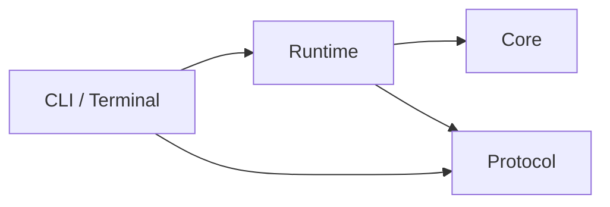

# Agent Game / Facility Zero 项目实施计划

规划日期：2026-10-02。依据：[技术研究报告](../agent_game_research_2026-10-02.md)，重点对应第 4–14、16–18 节。

2026-10-04 状态：M0–M5已实现并验收（T503为部分完成），M6的Windows golden与进程树清理已通过、1000种子扫描完成。四个生产项目与四个console验收项目齐备。225项检查通过，固定种子0–99全部可解、最长参考路线97回合、最大尝试次数1；seed 0–999全部可解、最大参考路线101。当前验收为Windows，Linux对照、分层性能基准、发布包与pwsh 7黑盒脚本重跑仍未完成，见 [M0–M1验收](milestones/m0-m1.md) 起的各里程碑记录。本文采用报告的C#/.NET方案；其余时间估算与未验收阶段参数仍属规划建议。

## 1. 项目目标与首版完成标准

构建一个可程序生成、可复现、供外部 Agent 控制的回合制设施探索游戏。人类可实时旁观或人工游玩，也可离线播放记录。脚本 Agent、后续 LLM Agent 和人类最终使用相同动作与规则。

v0.1 的完整闭环：生成场景 → 外部 Agent 握手 → 局部观测与逐步动作 → 实时终端旁观 → 完整记录 → 离线回放 → 动作重演核验。

发布前必须同时证明：

1. 任务可解：固定样例与生成场景都能通过同一 Core 执行参考动作完成。
2. 规则可复现：同版初始场景与固定动作在 Windows / Linux 得到相同逐步 Core 哈希和领域事件。
3. Agent 可替换：随机 Agent 与探索 Agent 使用同一 JSONL 接口，不改 Core。
4. Viewer 可替换：headless、TUI 与回放基于相同协议；固定动作的结果不受刷新率或慢订阅影响。
5. 错误可解释：非法协议、进程故障、记录故障、规则终止和回合截断分别报告。
6. 基本功能可离线使用：生成、脚本控制、人工模式、回放和核验不依赖模型服务。

## 2. 版本范围

| 版本 | 必须交付 | 开始条件 |
|---|---|---|
| v0.1 | Facility Zero 规则、生成/验证、子进程 Agent、Observer、记录/回放/核验、TUI、人工模式、两类脚本基线、发布文档 | 按 M0–M6 顺序推进 |
| v0.1.1 | 只读 WebSocket Observer 与 Canvas Viewer；复用现有 Snapshot / StepBatch | v0.1 发布门槛通过，特别是状态重建和慢订阅测试 |
| v0.2 | `serve --stdio` 环境控制协议、Gymnasium 适配、配对种子评测、多局外部调度 | 单局协议与重演稳定，先定义 reset/step/终止语义 |
| 后续按需 | LLM 供应商适配、复杂任务、多 Agent、动态危险、资源消耗 | 有明确能力目标，并评估规则/求解器/观测的版本影响 |

v0.1 不纳入 Web、ECS、数据库、通用任务 DSL、插件装载、模型供应商 SDK、RL 训练或多 Agent。LLM 接入可由独立 Agent 进程消费现有协议，但不作为首版发布前提。

## 3. 首版玩法与需冻结的规则

默认设施网格约 21×13；单 Agent、单门卡、单必经门、单核心。任务顺序为探索 → 拿卡 → 开门 → 取核心 → 返回出口。门卡不消耗，门打开后保持打开；拿核心本身不代表成功。

| 项目 | 首版决定 | 验收重点 |
|---|---|---|
| 动作 | `move(direction)`、`pickup`、`interact(direction)`、`wait`；绝对四方向，共 10 个离散动作 | 键盘、Python 与协议映射到同一领域 Action |
| 回合 | 每个领域动作推进 1 tick；撞墙、空拾取、缺卡交互也消耗回合 | 协议非法响应和超时不调用 Step |
| 终局 | 默认 512 回合；成功优先于同一步达到上限 | 最后允许回合返回出口成功；终局后拒绝 Step |
| 观测 | 每次仅发送当前可见格、位置、库存、任务与上次反馈 | 不发送全图、seed、参考路径或 Core 哈希 |
| 记忆 | Agent 自己保存历史；Viewer 自己保存显示记忆 | Agent 输入不包含 Host 自动累积的探索地图 |
| 坐标 | 建议原点为左上角，x 向右、y 向下；north 为 y−1 | 序列化、可见性与人工输入一致 |
| 可见性 | 建议半径 3、Chebyshev 距离；采用保守整数 supercover 视线，墙/闭门遮挡，阻挡格本身可见 | M0 用小地图冻结角点并列处理；对角墙缝不得透视；开启门后视野更新 |
| 初始任务阶段 | 建议 `find_key → open_door → find_core → return_to_exit → succeeded` | 阶段与库存/门状态一致；终局原因独立保存 |

坐标、可见性细节与阶段名称是为实现补充的建议，必须在 M0 样例和 M1 反例中确认。v0.1 场景采用固定玩法规格；地图扩容和新任务属于后续规则变更。

## 4. 架构与所有权

采用四个生产项目，测试项目不计入生产模块数。

| 项目 | 职责 | 项目引用 | 约束 |
|---|---|---|---|
| `AgentGame.Core` | Scenario、Game、动作规则、生成、求解、可见性、规范状态编码 | 无 | 仅规则与基础库；不引用 JSON、Process、Channel、终端或墙钟 |
| `AgentGame.Protocol` | Agent/Observer DTO、显式 JSON 编解码、边界校验 | 无 | 不引用 Core，不计算游戏规则 |
| `AgentGame.Runtime` | 单局所有者、进程生命周期、领域/DTO 映射、Hub、记录与核验 | Core、Protocol | 不绘图，不维护提示词，不引入模型 SDK |
| `AgentGame.Cli` | 命令参数、组合根、人工输入、TUI、退出码 | Runtime、Protocol | 不直接引用 Core；终端只能消费 Observer DTO |



Runtime 保证同一局内 Core 操作串行且只有一个逻辑所有者。异步 await 后不要求回到同一物理线程；stderr 排空、Viewer 消费和管道 I/O 可以独立运行，但不能读取或修改 Core。外部订阅/取消请求交给所有者处理。

Core 可内部维护可变数组；跨边界快照、观测、事件和补丁必须具有独立且不可变的数据所有权。C# record 不自动保证数组不可变，应通过复制、不可变集合或严格所有权验证。

只为明确替换边界设置接口：`IAgent`、`IReplayWriter`、Observer 订阅。内部 Grid、Direction、Door、Visibility 不逐类创建接口。

## 5. 协议与记录的关键契约

### 5.1 版本与编码

M0 冻结 `agent/1`、`observer/1`、`replay/1`、`scenario/1` 的字段与错误策略。规则、生成器、Core 规范编码和 view 编码各有独立版本；名称在 ADR 中确定，不把协议兼容等同于规则等价。

Agent 采用 UTF-8 JSONL，flush 后发送，一局一个持久进程，一次只有一个待响应请求。生命周期：hello → ready → observation/action 循环 → episode_end。request_id 使用字符串。

建议默认限制：启动握手 5 秒，单次决策 30 秒，单行 JSON 内容 64 KiB，JSON 深度 32，保留 stderr 尾部 64 KiB，每订阅队列 128 个 envelope。参数应可配置；精确计数与错误码在 M0 冻结。消息长度按字节在完整读行前限制，发送观测与等待响应共享决策期限。

关闭建议采用 1 秒正常退出宽限、3 秒强制终止等待；各阶段均有截止期限。数据大小上限还应覆盖 Observer 和场景读取，M0 根据固定地图最坏编码量设置，M4 实测验证。

### 5.2 Observer 与信息边界

- Snapshot 恢复一个指定 view 的 VisualState；不能用它恢复完整 Core。
- StepBatch 以一个原子消息包含该步语义事件和全部状态补丁；UI 不从事件推导规则。
- seq 表示发布顺序，tick 表示规则回合；waiting 等状态消息可改变 seq 而不推进 tick。
- Snapshot 的 base_seq 表示已涵盖的发布序号，订阅下一条必须为 base_seq+1；Snapshot 不额外占用广播序号。
- 注册在所有者边界一次返回 `(snapshot, subscription)`；重新订阅清空旧状态和过时动画。
- agent view 只投影允许的信息，局外旁观者记忆作为独立显示数据；全图视图必须显式指定，绝不转发给 Agent。
- 每个订阅者有独立有界队列；满队列就脱离，TUI 重新取快照。状态增量不能直接 DropOldest 后继续应用。

### 5.3 提交、记录和异常

提交顺序：Core 计算 → 规范动作/结果与观察批次 → 记录成功 → 更新最后提交边界并实时发布 → 下一次 Agent 请求。外围状态 envelope 也进入同一有序记录/发布路径，完整回放保留所有 seq。

写入成功是记录器完成约定的 append 操作，不承诺每步 fsync。v0.1 建议每步写入、按可配置间隔 flush、结束 flush；实际可读文件中的完整前缀是崩溃恢复依据。若之后 flush 报错，立即结束，不能宣称已正常持久化。

记录失败后 Core 可能已经前进一步；该步不发布、不继续运行，摘要按最后成功提交回合报告。不能直接拿内部已变更状态作为最后提交观测。footer 写入也可能失败，因此缺 footer 的记录标记 incomplete。

回放保存完整初始 Scenario、初始 ObserverSnapshot、版本、规范动作、ActionOutcome、逐步 Core 哈希、Observer envelope 和 footer。`replay` 只需要 Protocol/播放数据；`verify` 用同版 Core 重演。缺 footer 或尾部残行允许处理完整前缀但必须提示 incomplete；中间损坏停止并指出位置。

## 6. 场景生成与验证

先构造任务拓扑，再随机布局：入口/出口区 → 必经上锁门 → 核心区，门卡在门前可达区域。额外回路不得绕过门。

`scenario validate` 默认执行三层校验：

1. 结构：尺寸、边界、位置、对象数量和重叠关系符合 Facility Zero 规格。
2. 任务约束：无卡可达门卡；门关闭时到不了核心；开门后可以取核心并返程。
3. 完整求解：至少包含 `(position, has_key, door_open, has_core)`，参考动作通过同一 Core 成功且不超过回合上限。不能以地形 BFS 代替。

“可解但门可绕过”的地图违反任务规格，同样拒绝。生成器采用 PCG32 与命名随机流；参考来源、初始化、SHA-256 派生输入及字节序在 M0/M2 冻结并验证已知向量。观测、UI 和记录不得使用世界 RNG。

建议生成参考路径上限先设为 128 回合，有限重试先设为 16 次；这是首轮实现参数，在 M2 种子集检查后确认或通过 ADR 调整。禁止无限随机重试，失败保留 seed、版本、重试次数和原因。可解证书仅用于内部验证，不能进入普通 Agent 输入。

## 7. 里程碑、依赖与验收

按单名主要开发者、有 C# 基础并使用 Agent 辅助估算 17–24 个工作日，约 4–5 周。原规划时未核验 SDK；现已确认并固定全局 SDK 10.0.401，发布环境与 CI 条件仍待后续验证；工期不是承诺。每阶段验收通过后才进入下一阶段，实际偏差更新此表。

| 阶段 | 估算 | 主要交付物 | 通过门槛 |
|---|---:|---|---|
| M0 契约与样例 | 1–2 日 | 三份协议/记录文档、Scenario 规格、版本/错误表、两张手工小地图、消息 fixtures、ADR | 手工解释完整任务、无效动作、终局与序号；角点视野有期望样例 |
| M1 纯 Core | 2–3 日 | Game/Scenario/Action、规则、可见性、深度独立快照、规范哈希 | 参考链成功；撞墙耗时；最后回合成功；终局后拒绝；隐藏信息与快照所有权检查 |
| M2 生成与求解 | 3–4 日 | PCG32/命名流、拓扑生成、完整求解器、场景 JSON 导入导出与 validate | 已知向量一致；固定种子集可解；导出再导入状态一致；坏布局正确拒绝 |
| M3 Agent 与 Runtime | 3–4 日 | 进程会话、握手、严格解析、联合期限、stderr 排空、串行运行循环 | 随机 Agent 能正常结束一局；错误 ID/半行/洪流/崩溃/永不响应有界结束 |
| M4 Observer 与回放 | 4–5 日 | 投影/Hub、原子订阅、权威记录、replay、verify、初步机器 CLI | 每步补丁等于重投影；重订阅不漏消息；慢 Viewer 不改固定动作结果；离线播放和重演通过 |
| M5 终端与探索基线 | 2–3 日 | Spectre.Console TUI、play、暂停/单步/倍率、探索 Agent | TUI 只读 DTO；缩小终端可用；探索基线在固定样例成功；人工记录可回放核验 |
| M6 发布与文档 | 2–3 日 | Windows/Linux 包、CI、命令指南、失败样例、发布清单 | 干净环境可运行；stdout 无 ANSI/日志污染；退出码正确；进程清理跨平台验证 |

依赖主链为 M0 → M1 → M2 → M3 → M4 → M5 → M6。M0 的版本和 DTO 要提前固定；M2 的文件 I/O 放在 Runtime/CLI，生成与求解保持在 Core。

M3 先用协议 fixtures 和内部运行入口验证进程与规则闭环，不宣称权威记录已完成，也不开放尚未可靠的 `--record` 功能。M4 完成状态投影和记录后，再集成完整 run/replay/verify CLI，避免 Runtime 先依赖未完成的记录链。

首个 M0–M1 实施包已通过验收，M2、M3、M4 实施包随后分别通过（见 milestones/）；下一实施包限定 M5。原计划估算 M0–M1 为 3–5 工作日，不作为实际耗时记录；不得一次性实现全部版本。任务明细见 [backlog.md](backlog.md)。

## 8. 验证方案与发布证据

| 风险 | 验证方式 | 门槛 |
|---|---|---|
| 规则/视野错误 | 手工小地图与反例；独立期望状态 | 门卡依赖、返程、角点、闭门、终局全部覆盖 |
| 随机/状态漂移 | 独立 PCG 向量；规范编码 golden fixtures；跨平台固定动作 | 逐步状态哈希与事件完全一致 |
| 生成不可解 | 固定种子清单 + 用 Core 执行求解动作 | CI 建议 100 seeds；发布前扩展到 1000 seeds，保留失败清单 |
| 协议挂死 | 独立子进程 fixtures：错 ID、空行、半行、不 flush、超长、stderr 洪流、退出 | 每项在配置期限与清理窗口内结束；最后提交回合明确 |
| 记录损坏 | IReplayWriter 故障注入；尾残行、缺 footer、中间损坏、版本不匹配 | 完整前缀可识别；首个不一致或损坏位置明确 |
| Viewer 状态错误 | Snapshot + Batch 重建对照独立投影 | 每步及中途重订阅一致；seq 无缺口/重复 |
| 背压污染规则 | 容量缩至 1–2；慢 TUI/stdout；同一固定动作重跑 | 只影响订阅状态；Core 哈希与 headless 相同 |
| 进程残留 | 单进程与派生子进程 fixture；超时/取消后检查 | Windows/Linux 清理有界；实测不通过则补平台机制或明确缩减支持范围 |
| 标准流污染 | 重定向 stdout 并逐行解析 | 机器模式没有横幅、ANSI 或诊断；诊断只在 stderr |

100/1000 seeds 与缓冲参数均为建议验收规模。必须写明固定种子列表及生成版本，不能随机选若干样例后报告“所有场景可解”。Random Agent 正常完成运行不要求任务成功；Explorer 只要求在明确列出的样例成功，首版不承诺所有种子 100% 成功。

每个里程碑留一份验收记录：提交/版本、环境、可运行命令、通过项、失败反例和未解决限制。性能先分别测 Core、观测、编解码、记录与 Agent 往返，建立基准，不提前承诺吞吐数字。headless 且无记录/订阅时不建立 TUI 或无人消费的队列。

## 9. 首版命令面与退出约定

命令面实现状态：`scenario generate|validate`、`run`（`--headless` / `--observer-stdout` / `--tui`）、`play`、`replay`（JSONL 导出或 `--tui [--speed N]` 终端回放）、`verify` 均已实现并纳入验收；尚未实现的是网页旁观（v0.1.1）与环境控制协议（v0.2）。

```text
agent-game scenario generate --seed 114514 --out facility.json
agent-game scenario validate facility.json
agent-game run --scenario facility.json --record run.jsonl -- python3 -u agents/explorer_agent.py
agent-game run --scenario facility.json --headless --record run.jsonl -- python3 -u agents/random_agent.py
agent-game run --scenario facility.json --observer-stdout --record run.jsonl -- python3 -u agents/random_agent.py
agent-game run --scenario facility.json --tui -- python3 -u agents/explorer_agent.py
agent-game play --scenario facility.json --record human.jsonl
agent-game replay run.jsonl
agent-game replay run.jsonl --tui --speed 2
agent-game verify run.jsonl
```

Windows 文档以实际安装的 Python 可执行文件替换示例中的 python3。`--` 后直接传 executable 与参数数组，禁止再次通过 shell 拼接。`--observer-stdout` 独占 stdout，摘要改走 stderr；`--headless` 表示不挂任何终端旁观者，与 `--observer-stdout` 互斥（在 M5 终端成为默认前，它就是默认行为）。

退出码（M3 起实际采用的约定，见 [runtime-execution.md](runtime-execution.md)）：0 正常运行结束（含规则失败/回合截断）；1 运行失败（Agent 执行错误、记录 I/O 错误、场景无效）或 `verify` 不一致/无法核验、`replay` 尾部残缺；2 参数或选项错误；130 用户取消。规划早期曾建议用 3/4/5 分别区分 Agent、记录与核验失败，实际实现改为[^codes]：**稳定的机器可读契约是摘要 JSON 中的 `kind`、`error.code`，以及 `verify` 结果的 `valid`/`status`/`error`/`line`/`tick`/`core_hash` 字段**，退出码只区分“成功/失败/用法错误/取消”，以免与取消码 130 及平台约定冲突。该决定在 M3 冻结，M4 由 CLI 黑盒检查固化。

[^codes]: 例：记录失败时 `kind=execution_error` 且 `error.code=record_error`；`verify` 失败输出 `{"valid":false,"error":"invalid_record","line":N}`，成功输出 `{"valid":true,"status":"completed","tick":N,"core_hash":"..."}`。因此脚本应按 JSON 字段分支，而不是按退出码猜测原因。

正常游戏结果放在结构化摘要；慢实时 stdout 默认脱离（`resync_required`/`output_timeout` 只作为 stderr 的一行 `observer_error` 输出，**不在摘要里**）但宿主继续，规则结果不受订阅者速度影响。无损导出从回放读取；未指定 `--record` 时不会自动保存完整流。

## 10. 风险处理与后续决策

- SDK 与依赖：M0 已将实测全局 SDK 10.0.401 写入 global.json；固定 Spectre.Console 和测试库版本。未验证前不填写猜测的补丁号。
- 进程清理：先实测 .NET 进程树终止路径；若出现子孙残留，再评估 Windows Job Object / Linux 进程组。不能把这些机制写成已验证的默认保证。
- 记录语义：区分逻辑提交、缓冲写入、flush 与掉电持久性；以完整文件前缀核验，优先修复记录链再增加 UI。
- 信息泄露：DTO 与日志分层，Agent 输入 fixtures 检查无全图/seed；本地进程权限不等同于竞赛隔离，正式评测另设阶段。
- 生成复杂度：固定首版任务，先构造拓扑；校验不能维护另一份近似规则。新规则必须同时更新求解器、版本和测试。
- 排期扩大：M2/M4 未过则暂停 Web/评测扩展；可压缩视觉效果或增加排期，不能删掉重建/核验正确性验收。

ADR 先保留报告的八项决策：001 C# 主栈；002 单局所有者；003 双协议；004 JSONL/持久进程；005 Snapshot+StepBatch；006 实时脱离与无损记录；007 复杂度控制；008 回放兼顾播放/核验。新增 009 可见性与坐标、010 生成校验及预算、011 超时/错误/提交参数。每项标注决定、理由和重新评估条件。

后续 v0.1.1 只增加观察宿主与 Web 客户端，不更改 Core；v0.2 先定义宿主环境控制协议，区分 terminated、truncated 和执行异常。评测使用同场景配对清单，Oracle 单列，LLM 的模型/提示词/记忆/重试/成本记录留在 Agent 与评测层。
